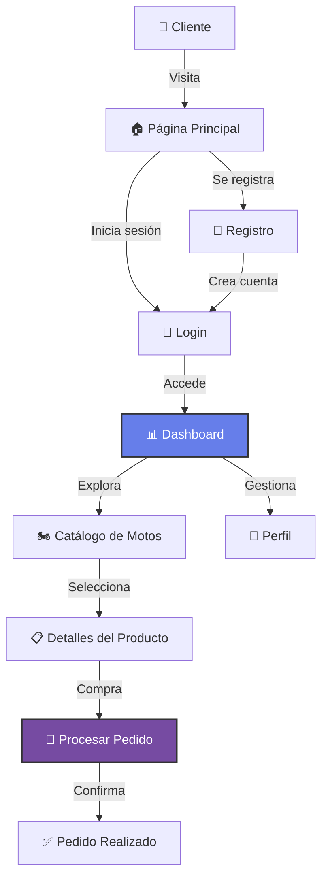

<table>
  <tr>
    <td width="150">
      
    </td>
    <td>
      <h1>Moto Store</h1>
      <em>"La mejor tienda de motos deportivas"</em>
    </td>
  </tr>
</table>


## 💡 Sobre Moto Store

**Moto Store** es una tienda en línea de motos deportivas con un diseño moderno y atractivo. Incluye sistema de autenticación, catálogo de productos, perfil de usuario y procesamiento de pedidos.

### ✨ Características Principales

* **Catálogo de Motos** - Explora modelos deportivos
* **Sistema de Pedidos** - Proceso de compra completo
* **Perfiles de Usuario** - Dashboard personalizado
* **Diseño Atractivo** - Gradientes modernos y animaciones

### 🔄 Flujo de Compra



---

## ✨ Características Destacadas

| ⚡ Funcionalidad | 📌 Detalle |
|-----------------|-----------|
| **Autenticación Segura** | Login y registro con validación |
| **Catálogo Dinámico** | Motos con imágenes y especificaciones |
| **Perfil de Usuario** | Edición de datos personales |
| **Proceso de Pedido** | Sistema de compra integrado |
| **Diseño Responsive** | Adaptable a móviles |

---

## 🎨 Badges & Estado


---

## ⚙️ Instalación y Configuración

### 1️⃣ Clonar el Repositorio

```bash
git clone https://github.com/JoseEduardoGR/Moto-Store.git
cd Moto-Store
```

### 2️⃣ Configurar Base de Datos

```sql
CREATE DATABASE moto_store;
USE moto_store;
-- Importar esquema
```

### 3️⃣ Configurar Conexión

Edita `includes/security.php` con tus credenciales:

```php
$host = "localhost";
$db_name = "moto_store";
$username = "tu_usuario";
$password = "tu_password";
```

### 4️⃣ Iniciar Servidor

```bash
php -S localhost:8000
```

Abre `http://localhost:8000` en tu navegador.

---

## 📂 Estructura del Proyecto

```
MOTO-STORE/
├── css/
│   └── styles.css           # Estilos principales
├── js/
│   └── *.js                 # Scripts del frontend
├── images/                  # Imágenes de productos
├── includes/
│   └── security.php         # Seguridad y conexión
├── scripts/                 # Scripts adicionales
├── dashboard.php            # Panel de usuario
├── index.php                # Página principal
├── login.php                # Inicio de sesión
├── logout.php               # Cerrar sesión
├── register.php             # Registro
├── perfil.php               # Perfil de usuario
├── procesar_pedido.php      # Procesar compras
├── LICENSE                  # Licencia MIT
└── README.md                # Este archivo
```

---

## 🏍️ Tipos de Motos

| Categoría | Descripción |
|-----------|-------------|
| **Deportivas** | Alta velocidad y rendimiento |
| **Naked** | Estilo urbano sin carenado |
| **Adventure** | Para todo terreno |
| **Clásicas** | Diseño retro |

---

## 🛠️ Tecnologías Utilizadas

| Tecnología | Uso |
|------------|-----|
| **PHP 8+** | Backend y lógica |
| **MySQL** | Base de datos |
| **CSS3** | Diseño con gradientes |
| **JavaScript** | Interactividad |

---

## 🏆 Créditos

**JoseEduardoGR** – Desarrollo y diseño.

💻 Proyecto educativo de preparatoria.

---

## 📄 Licencia

Este proyecto está bajo la **Licencia MIT** - ver el archivo [LICENSE](LICENSE) para más detalles.

---

<div align="center">
  <p>🏍️ Hecho con ❤️ por <a href="https://github.com/JoseEduardoGR">JoseEduardoGR</a></p>
  <p>Velocidad y estilo en cada moto</p>
</div>
